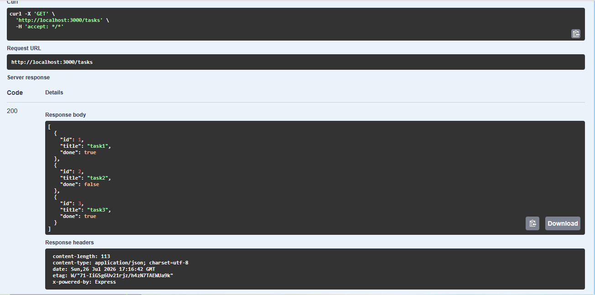

<h1 align="center">Task API</h1>

## Introduction

This is a simple REST API built with **Node.js** and **Express** for managing tasks. It supports full CRUD (Create, Read, Update, Delete) operations and includes interactive API documentation using Swagger UI.


## Prerequisites 
- Node.js (v18 or later)
- npm (comes with Node.js)

## Installation

```bash
git clone https://github.com/Salma-kabel/FlyRank-Ai.git
cd "FlyRank-Ai"
cd "Assignment 1"
npm install
```

## Running the Server

```bash
node server.js
```

## Endpoints Table

| Method | Endpoint      | Description                          |
| ------ | ------------- | ------------------------------------ |
| GET    | `/`           | Returns API information              |
| GET    | `/health`     | Checks whether the server is running |
| GET    | `/tasks`      | Returns all tasks                    |
| GET    | `/tasks/{id}` | Returns a task by ID                 |
| POST   | `/tasks`      | Creates a new task                   |
| PUT    | `/tasks/{id}` | Updates a task by ID                 |
| DELETE | `/tasks/{id}` | Deletes a task by ID                 |


## Example Command

Command:

```bash
curl -i http://localhost:3000/tasks
```
Output:

```http
HTTP/1.1 200 OK
X-Powered-By: Express
Content-Type: application/json; charset=utf-8
Content-Length: 113
ETag: W/"71-IiGSg6Uv21rjz/h4zN7TAEWUa9k"
Date: Tue, 28 Jul 2026 11:59:55 GMT
Connection: keep-alive
Keep-Alive: timeout=5

[
    {"id":1,"title":"task1","done":true},
    {"id":2,"title":"task2","done":false},
    {"id":3,"title":"task3","done":true}
]
```

## Swagger UI

Open the following URL after starting the server to access the interactive Swagger UI:

```text
http://localhost:3000/docs
```




