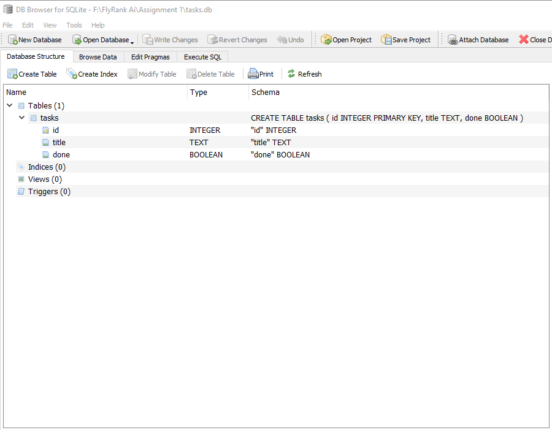
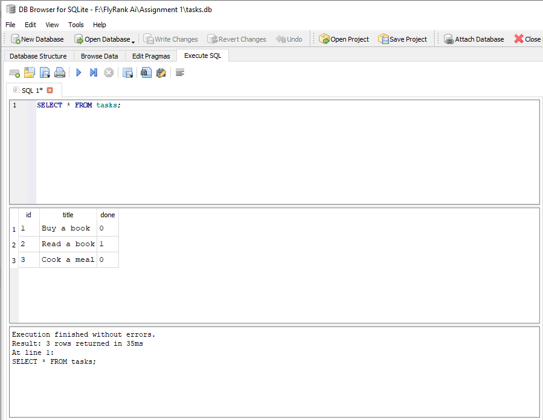

<h1 align="center">Task API</h1>

## Introduction

This is a simple REST API built with **Node.js**, **Express**, and **SQLite** for managing tasks. It supports full CRUD (Create, Read, Update, Delete) operations and includes interactive API documentation using Swagger UI.


## Prerequisites 
- Node.js (v18 or later)
- npm (comes with Node.js)

## Installation

```bash
git clone https://github.com/Salma-kabel/FlyRank-Ai.git
cd "FlyRank-Ai"
cd "Assignment 1"
npm install
```

## Running the Server

```bash
npm start
```

## Endpoints Table

| Method | Endpoint      | Description                                    |
| ------ | ------------- | -----------------------------------------------|
| GET    | `/`           | Returns API information                        |
| GET    | `/health`     | Checks whether the server is running           |
| GET    | `/tasks`      | Returns all tasks/optional filtering and search|
| GET    | `/tasks/{id}` | Returns a task by ID                           |
| POST   | `/tasks`      | Creates a new task                             |
| PUT    | `/tasks/{id}` | Updates a task by ID                           |
| DELETE | `/tasks/{id}` | Deletes a task by ID                           |
| GET    | `/stats`      | Returns task statistics                        |
| POST   | `/reset`      | Restores the initial database tasks            |


## Example Command

Command:

```bash
curl -i http://localhost:3000/tasks
```
Output:

```http
HTTP/1.1 200 OK
X-Powered-By: Express
Content-Type: application/json; charset=utf-8
Content-Length: 113
ETag: W/"71-IiGSg6Uv21rjz/h4zN7TAEWUa9k"
Date: Tue, 28 Jul 2026 11:59:55 GMT
Connection: keep-alive
Keep-Alive: timeout=5

[
    {"id":1,"title":"task1","done":true},
    {"id":2,"title":"task2","done":false},
    {"id":3,"title":"task3","done":true}
]
```

## Swagger UI

Open the following URL after starting the server to access the interactive Swagger UI:

```text
http://localhost:3000/docs
```
### Swagger UI Home


### GET /tasks Response

The response returned after executing the **GET /tasks** endpoint in Swagger UI.


## Optional Extras Added

- Filtering tasks:
  - `GET /tasks?done=true` returns completed tasks
  - `GET /tasks?done=false` returns incomplete tasks

- Searching tasks:
  - `GET /tasks?search=word` returns tasks whose titles contain the search term

- Statistics:
  - `GET /stats` returns the total number of tasks, completed tasks, and open tasks

- Reset:
  - `POST /reset` resets the database to its initial state

## Database Choice

SQLite was chosen because it is lightweight, requires no separate database server, and is easy to set up. 
It stores the entire database in a single file, which makes it suitable for this small Task API project.

## Database Location

The SQLite database file is stored at:

`./tasks.db`

## Database Initialization

The database and required tables are automatically created when the server starts.
No manual database setup is required after cloning the repository.

## Database Persistence

Task data is stored in SQLite, so changes made through the API are preserved after restarting the server.

## Database Screenshot



## Example SQL Query

Example query used to view all tasks:

```sql
SELECT * FROM tasks;
```

