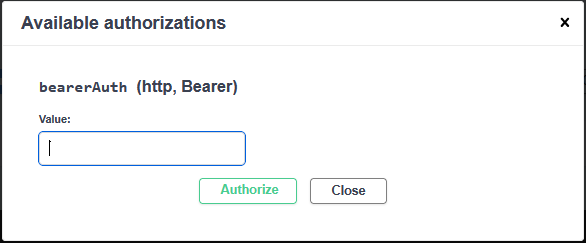
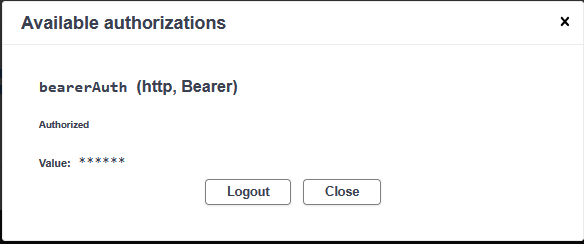
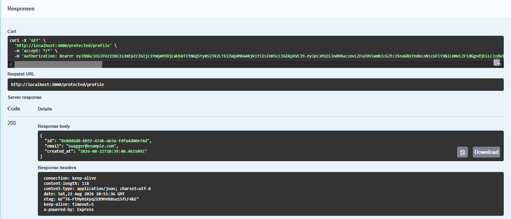
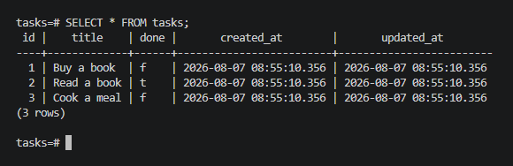

<h1 align="center">Task API</h1>

## Introduction

This project is a secure REST API built with **Node.js**, **Express**, **PostgreSQL**, and **Supabase Auth**.

The API provides task management functionality together with user authentication. Users can:

- Create an account
- Log in and receive JWT access and refresh tokens
- Access protected endpoints using a Bearer JWT
- Log out through a protected logout endpoint
- Access public endpoints without authentication
- Manage tasks through the REST API

The application runs together with PostgreSQL using **Docker Compose**. Interactive API documentation is provided through **Swagger UI**, including Bearer JWT authentication for protected endpoints.

## Architecture

The application follows a layered architecture:

```text
Routes
   ↓
Middleware
   ↓
Services
   ↓
Repositories / Supabase
```
- Routes handle HTTP requests and responses.
- Authentication middleware verifies Bearer JWTs before protected routes are executed.
- Services contain the application's business logic.
- Repository handles PostgreSQL data access for task operations.
- Supabase Auth handles user authentication and JWT verification.

## Prerequisites

- Docker Desktop
- A Supabase project
- Git

## Installation

```bash
git clone https://github.com/Salma-kabel/FlyRank-Ai.git
cd "FlyRank-Ai"
cd "Assignment"
```
## Environment Variables

The application uses environment variables for database, Redis, and Supabase configuration.

Copy the provided `.env.example` file to `.env` before starting the application.

### Windows PowerShell

```powershell
Copy-Item .env.example .env
```
### Linux
```bash
cp .env.example .env
```
The `.env.example` file contains all required environment variable names. Update the values in `.env` with your own configuration, including your Supabase project URL and authentication key.

## Running the Server

### Start the application and PostgreSQL together:

After copying `.env.example` to `.env`, start the application and PostgreSQL database with:

```bash
docker compose up --build
```
On subsequent runs, you can simply use:

```bash
docker compose up
```

The API will be available at http://localhost:3000 after the containers start.

Swagger UI will be available at http://localhost:3000/docs.

### Stop the containers

```bash
docker compose down
```

## Endpoints Table

| Method | Endpoint | Description | Auth Required |
|---|---|---|---|
| GET | `/` | Returns information about the API | No |
| GET | `/health` | Checks that the API is running and verifies the PostgreSQL connection | No |
| GET | `/tasks` | Returns all tasks with optional filtering and search | No |
| GET | `/tasks/{id}` | Returns a task by ID | No |
| POST | `/tasks` | Creates a new task | No |
| PUT | `/tasks/{id}` | Updates a task by ID | No |
| DELETE | `/tasks/{id}` | Deletes a task by ID | No |
| GET | `/stats` | Returns task statistics | No |
| POST | `/reset` | Restores the initial database tasks | No |
| POST | `/auth/signup` | Creates a new user account | No |
| POST | `/auth/login` | Logs in a user and returns JWT tokens | No |
| POST | `/auth/logout` | Logs out the authenticated user | Yes |
| GET | `/public/info` | Returns public information | No |
| GET | `/protected/profile` | Returns the authenticated user's profile | Yes |
| GET | `/protected/dashboard` | Returns protected dashboard information | Yes |

## Authentication

The API uses **Supabase Auth** for user authentication.

### Sign Up

Create a user account:

```http
POST /auth/signup
```
Example request:
```json
{
  "email": "user@example.com",
  "password": "password123"
}
```
### Login
Log in using the registered credentials:
```http
POST /auth/login
```
A successful login returns an access_token and refresh_token.

### Accessing Protected Routes
Protected endpoints require the access token in the Authorization header:

```http
Authorization: Bearer <access_token>
```
### Logout

The logout endpoint is protected and requires a valid access token:

```http
POST /auth/logout
```
A successful logout returns 204 No Content.

## Authentication Flow

```text
POST /auth/signup
        ↓
   Create account
        ↓
POST /auth/login
        ↓
   Receive JWT
        ↓
Swagger Authorize
        ↓
Authorization: Bearer <JWT>
        ↓
Authentication Middleware
        ↓
Supabase verifies JWT
        ↓
Protected Route
```
The authentication middleware is reusable across protected endpoints, preventing authentication logic from being duplicated inside individual routes.

## Example Command

Command:

The following command returns all tasks. The API returns tasks ordered alphabetically by title by default.

```bash
curl -i http://localhost:3000/tasks
```
Output:

```http
HTTP/1.1 200 OK
X-Powered-By: Express
Content-Type: application/json; charset=utf-8
Content-Length: 248
ETag: W/"f8-NTMghTgbS0cjHf9kO7xiwhBSyyo"
Date: Sun, 02 Aug 2026 13:51:24 GMT
Connection: keep-alive
Keep-Alive: timeout=5

[
  {"id":1,"title":"Buy a book","done":false},
  {"id":3,"title":"Cook a meal","done":false},
  {"id":2,"title":"Read a book","done":true}
]
```

## Swagger UI

Interactive API documentation is available at:

```text
http://localhost:3000/docs
```
Swagger UI includes the API's public and protected endpoints.

Protected endpoints are marked with a 🔒 lock icon.
### Swagger UI Home


### GET /tasks Response

The response returned after executing the **GET /tasks** endpoint in Swagger UI.


### Using JWT Authentication in Swagger

1. Create an account using POST /auth/signup.
2. Log in using POST /auth/login.
3. Copy the returned access_token.
4. Click the Authorize button in Swagger UI.
5. Enter the JWT access token.
6. Click Authorize.
7. Use Try it out on a protected endpoint such as GET /protected/profile

    

### Protected Profile Response
 

## Database Screenshot

The following screenshot shows the seeded data stored in the PostgreSQL `tasks` table.



## Optional Extras Added

- Filtering tasks:
  - `GET /tasks?done=true` returns completed tasks
  - `GET /tasks?done=false` returns incomplete tasks

- Searching tasks:
  - `GET /tasks?search=word` returns tasks whose titles contain the search term

- Statistics:
  - `GET /stats` returns the total number of tasks, completed tasks, and open tasks

- Reset:
  - `POST /reset` resets the database to its initial state

- Timestamps:
  - Stores the creation and last updated timestamps for each task.

- Alphabetical sorting:
  - `GET /tasks` returns tasks ordered alphabetically by title.

## Database Choice

PostgreSQL was chosen because it is a production-ready relational database that supports concurrent connections, robust SQL features, and is commonly used in backend applications. Running PostgreSQL in Docker provides a consistent development environment without requiring a local database installation.

## Database Initialization

The PostgreSQL database and the required `tasks` table are automatically initialized when the application starts. If the table is empty, three sample tasks are inserted automatically.
No manual database setup is required after cloning the repository.

## Database Persistence

The PostgreSQL database uses a Docker volume (`postgres-data`) to persist data. Tasks remain available after the containers are stopped and started again because the PostgreSQL data is stored in a persistent Docker volume.

### Persistence Verification

To verify database persistence:

1. Started the application with `docker compose up`.
2. Created and modified tasks using the API.
3. Stopped the containers with `docker compose down`.
4. Started the application again with `docker compose up`.
5. Confirmed that the previously created and modified tasks were still present.

This demonstrates that PostgreSQL data is persisted using the Docker volume (`postgres-data`).

## Multi-stage Docker Build

The application uses a multi-stage Dockerfile to separate the build stage from the runtime stage.

## Image Size Comparison

| Build | Content Size |
| ------ | ------------ |
| Before multi-stage | 446 MB |
| After multi-stage | 443 MB |

Using a multi-stage Dockerfile separates the build and runtime stages. In this project, the image size reduction was small because both stages use the same `node:24` base image and the application does not require additional build tools.

## Technologies Used

- Node.js
- Express
- PostgreSQL
- Docker
- Docker Compose
- pg
- Redis
- Supabase Auth
- JWT
- Swagger UI
- swagger-jsdoc
- swagger-ui-express


