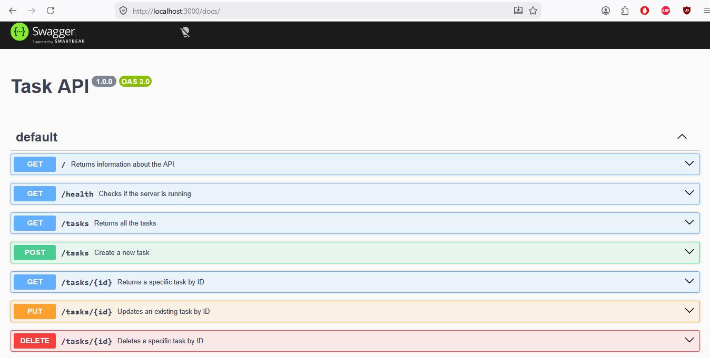

<h1 align="center">Task API</h1>

## Introduction

This is a simple REST API built with **Node.js**, **Express**, and **PostgreSQL** for managing tasks. The application runs together with a PostgreSQL database using **Docker Compose** and supports full CRUD (Create, Read, Update, Delete) operations. Interactive API documentation is provided through Swagger UI.

## Architecture

The application keeps the same route and service layers as the previous version. Only the data access layer was replaced by a PostgreSQL repository using the `pg` library. The service and route responsibilities remained the same, with the primary change being the use of asynchronous database operations.

## Prerequisites 
- Docker Desktop (recommended)

## Installation

```bash
git clone https://github.com/Salma-kabel/FlyRank-Ai.git
cd "FlyRank-Ai"
cd "Assignment"
```
## Environment Variables

The default values in `.env.example` work with the provided Docker Compose configuration. You only need to modify them if you want to use different database credentials or settings.

Copy the example environment file:

```bash
cp .env.example .env
```

On Windows PowerShell:

```powershell
Copy-Item .env.example .env
```

## Running the Server

### Start the application and PostgreSQL together:

This command builds the application image (the first time) and starts both the Express application and the PostgreSQL database.

```bash
docker compose up --build
```

The API is available at http://localhost:3000 after the containers start.

Swagger UI is available at http://localhost:3000/docs.

### Stop the containers:

```bash
docker compose down
```

### Subsequent Runs

After the initial build, start the application with:

```bash
docker compose up
```

## Endpoints Table

| Method | Endpoint      | Description                                    |
| ------ | ------------- | -----------------------------------------------|
| GET    | `/`           | Returns API information                        |
| GET    | `/health`     | Checks whether the server is running           |
| GET    | `/tasks`      | Returns all tasks with optional filtering and search|
| GET    | `/tasks/{id}` | Returns a task by ID                           |
| POST   | `/tasks`      | Creates a new task                             |
| PUT    | `/tasks/{id}` | Updates a task by ID                           |
| DELETE | `/tasks/{id}` | Deletes a task by ID                           |
| GET    | `/stats`      | Returns task statistics                        |
| POST   | `/reset`      | Restores the initial database tasks            |


## Example Command

Command:

The following command returns all tasks. The API returns tasks ordered alphabetically by title by default.

```bash
curl -i http://localhost:3000/tasks
```
Output:

```http
HTTP/1.1 200 OK
X-Powered-By: Express
Content-Type: application/json; charset=utf-8
Content-Length: 248
ETag: W/"f8-NTMghTgbS0cjHf9kO7xiwhBSyyo"
Date: Sun, 02 Aug 2026 13:51:24 GMT
Connection: keep-alive
Keep-Alive: timeout=5

[
  {"id":1,"title":"Buy a book","done":false},
  {"id":3,"title":"Cook a meal","done":false},
  {"id":2,"title":"Read a book","done":true}
]
```

## Swagger UI

Open the following URL after starting the server to access the interactive Swagger UI:

```text
http://localhost:3000/docs
```
### Swagger UI Home


### GET /tasks Response

The response returned after executing the **GET /tasks** endpoint in Swagger UI.


## Optional Extras Added

- Filtering tasks:
  - `GET /tasks?done=true` returns completed tasks
  - `GET /tasks?done=false` returns incomplete tasks

- Searching tasks:
  - `GET /tasks?search=word` returns tasks whose titles contain the search term

- Statistics:
  - `GET /stats` returns the total number of tasks, completed tasks, and open tasks

- Reset:
  - `POST /reset` resets the database to its initial state

- Timestamps:
  - Stores the creation and last updated timestamps for each task.

- Alphabetical sorting:
  - `GET /tasks` returns tasks ordered alphabetically by title.

## Database Choice

PostgreSQL was chosen because it is a production-ready relational database that supports concurrent connections, robust SQL features, and is commonly used in backend applications. Running PostgreSQL in Docker provides a consistent development environment without requiring a local database installation.

## Database Initialization

The PostgreSQL database and the required `tasks` table are automatically initialized when the application starts. If the table is empty, three sample tasks are inserted automatically.
No manual database setup is required after cloning the repository.

## Database Persistence

The PostgreSQL database uses a Docker volume (`postgres-data`) to persist data. Tasks remain available after the containers are stopped and started again because the PostgreSQL data is stored in a persistent Docker volume.

### Persistence Verification

To verify database persistence:

1. Started the application with `docker compose up`.
2. Created and modified tasks using the API.
3. Stopped the containers with `docker compose down`.
4. Started the application again with `docker compose up`.
5. Confirmed that the previously created and modified tasks were still present.

This demonstrates that PostgreSQL data is persisted using the Docker volume (`postgres-data`).

## Index Testing

A dataset of 10,000 tasks was generated to test query performance and compare query execution plans before and after adding an index.

The purpose of this test was to observe how PostgreSQL changes its query strategy when an index is available.

### Before adding an index

The following query was tested:

```sql
EXPLAIN ANALYZE
SELECT *
FROM tasks
WHERE title = 'Task 9000';
```

Before creating an index, PostgreSQL used a sequential scan (`Seq Scan`). This means PostgreSQL scanned the table row by row and checked each row until it found the matching task.

Output:

```text
Seq Scan on tasks  (cost=0.00..166.50 rows=37 width=53) (actual time=1.857..1.936 rows=1 loops=1)
  Filter: (title = 'Task 9000'::text)
  Rows Removed by Filter: 10005
Planning Time: 10.587 ms
Execution Time: 2.031 ms
```

### After adding an index on the title column

An index was created on the `title` column:

```sql
CREATE INDEX idx_tasks_title
ON tasks(title);
```

The same query was executed again:

```sql
EXPLAIN ANALYZE
SELECT *
FROM tasks
WHERE title = 'Task 9000';
```

After adding the index, PostgreSQL used an index scan (`Index Scan`). Instead of scanning the entire table, PostgreSQL used the index to locate the matching row directly.

Output:

```text
Index Scan using idx_tasks_title on tasks  (cost=0.29..8.30 rows=1 width=30) (actual time=0.729..0.778 rows=1 loops=1)
  Index Cond: (title = 'Task 9000'::text)
Planning Time: 17.456 ms
Execution Time: 7.324 ms
```

The index changed the query execution plan from a sequential scan to an index scan. This allows PostgreSQL to locate matching rows using the index instead of scanning the entire table. The benefit of indexes becomes more noticeable as the dataset size increases.

## Technologies Used

- Node.js
- Express
- PostgreSQL
- Docker
- Docker Compose
- pg
- Swagger UI


